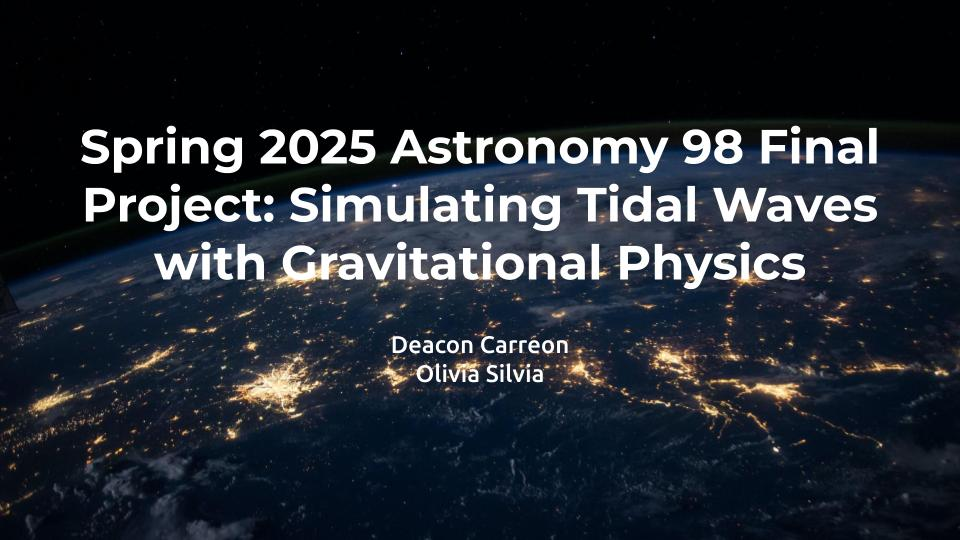
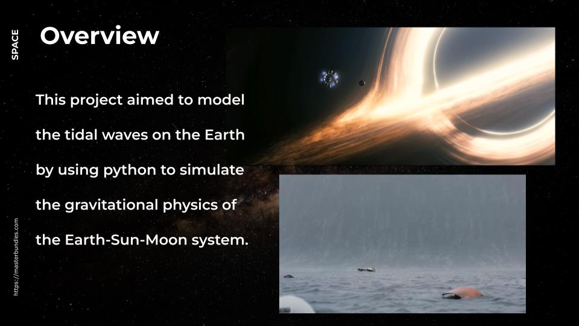

# Spring 2025 Final Projects
Please enjoy the final projects of students during the Spring 2025 semester.

## Simulating Tidal Waves with Gravitational Physics 
**Group Members:** Deacon Carreon and Olivia Silvia

The goal for this project was to model the tides of the Earth-Moon-Sun system. To do this, we
simulated the positions of all three objects using equations of gravity and mechanics. With these
distances we simulated the tidal wave heights at any inputted latitude on the Earth, ultimately
putting it into an animation, based on the function parameter of time.

<strong>Click to view slides</strong>

<video width="100%" controls loop autoplay muted>
  <source src="../../assets/projects/spring-2025/Deacon_Silvia/Deacon_Silvia.mov" type="video/mp4">
  Your browser does not support the video tag.
</video>

## Other Projects

### ???
**Group Members:** Eva and Serina

### ???
**Group Members:** Yuang Li

### ???
**Group Members:** Charlie Beckner

### Power Output 
**Group Members:** Giancarlo Ursellii